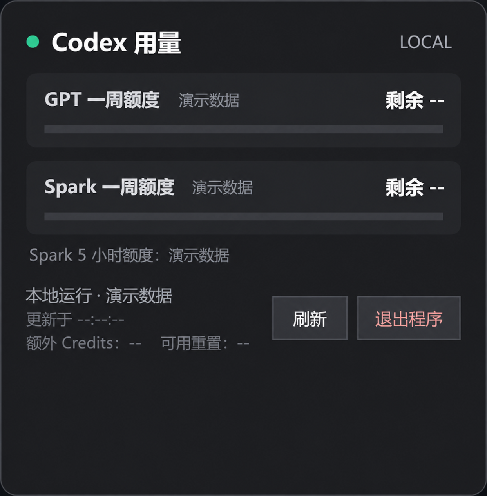

# Codex Quota Widget for Windows 11

[中文](#中文) | [English](#english)

## 运行截图 / Screenshots

任务栏小组件 / Taskbar widget


详细看板 / Detailed dashboard



> 截图中的额度、重置时间和套餐信息均已脱敏并替换为演示数据。<br>
> Quotas, reset times, and plan details shown above have been anonymized and replaced with demo data.

## 中文

### 发布介绍

Codex Quota Widget 是一个轻量、本地运行的 Windows 11 任务栏小组件，用来随时查看 GPT 与 GPT-5.3-Codex-Spark 的剩余额度。它直接贴在主任务栏左侧，不需要打开浏览器，也不依赖额外的后台服务器。

程序、配置和界面都保留在你的电脑上。它只会读取本机已有的 Codex 登录信息，并直接向 ChatGPT 的用量接口查询额度；访问令牌仅在内存中使用，不会被写入日志或上传到第三方服务。

当前版本：**v0.4（2026-09-02）**。

### 功能

- 两行显示 GPT 与 GPT-5.3-Codex-Spark 的一周剩余额度。
- GPT 或 Spark 的周剩余额度不高于 20% 时显示红点。
- Spark 的 5 小时剩余额度低于 10% 时显示黄点，提示该模型可能暂时缓慢或不可用。
- 单击任务栏组件打开详细看板。
- 每 60 秒自动刷新。
- 右键可刷新、设置开机启动、隐藏托盘图标或退出。
- 任务栏隐藏时组件跟随隐藏。
- 支持 Per-Monitor V2 DPI，连接、断开显示器或改变缩放后自动适配。
- 按接口返回的窗口秒数识别短期和周额度，不存在的窗口显示为 `--`。

### 直接运行

下载 [`dist/CodexQuotaWidget.exe`](dist/CodexQuotaWidget.exe)，双击运行。程序不需要管理员权限。

### 登录信息与隐私

程序依次从以下位置读取 Codex 登录信息：

1. `%CODEX_HOME%\auth.json`
2. `%USERPROFILE%\.codex\auth.json`
3. 当前目录下的 `.codex\auth.json`

访问令牌只用于直接请求 `https://chatgpt.com/backend-api/wham/usage`，不会写入日志或发送到第三方服务器。仓库不包含任何登录令牌、账户信息或本机 `auth.json`。

### 构建

在 Windows PowerShell 中运行：

```powershell
powershell -NoProfile -ExecutionPolicy Bypass -File .\build.ps1
```

构建脚本使用 Windows 自带的 .NET Framework 4.x C# 编译器，不需要额外安装 NuGet 包。生成文件位于 `dist\CodexQuotaWidget.exe`。

## English

### Release introduction

Codex Quota Widget is a lightweight, locally running Windows 11 taskbar widget for checking the remaining GPT and GPT-5.3-Codex-Spark usage quotas at a glance. It sits directly on the left side of the primary taskbar, so there is no need to keep a browser open or run an additional backend service.

The application, its settings, and its interface stay on your computer. It reads the existing local Codex authentication data only to query the ChatGPT usage endpoint directly. The access token is kept in memory and is never written to logs or sent to a third-party service.

Current version: **v0.4 (2026-09-02)**.

### Features

- Shows weekly remaining quotas for GPT and GPT-5.3-Codex-Spark in two compact rows.
- Displays a red indicator when either weekly quota is at or below 20%.
- Displays a yellow indicator when the Spark five-hour quota falls below 10%, meaning the model may temporarily be slow or unavailable.
- Opens a detailed dashboard with one click.
- Refreshes automatically every 60 seconds.
- Provides refresh, startup, tray visibility, and exit controls from the context menu.
- Follows taskbar visibility and supports Per-Monitor V2 DPI scaling when displays or scaling settings change.
- Detects short-term and weekly windows from the durations returned by the endpoint; unavailable windows are shown as `--`.

### Run

Download [`dist/CodexQuotaWidget.exe`](dist/CodexQuotaWidget.exe) and launch it. Administrator privileges are not required.

### Authentication and privacy

The widget looks for existing Codex authentication data in this order:

1. `%CODEX_HOME%\auth.json`
2. `%USERPROFILE%\.codex\auth.json`
3. `.codex\auth.json` in the current directory

The token is used only for direct requests to `https://chatgpt.com/backend-api/wham/usage`. It is not written to logs or sent to a third-party server. This repository contains no login tokens, account data, or local `auth.json` files.

### Build

Run in Windows PowerShell:

```powershell
powershell -NoProfile -ExecutionPolicy Bypass -File .\build.ps1
```

The build script uses the .NET Framework 4.x C# compiler included with Windows and requires no additional NuGet packages. The executable is generated at `dist\CodexQuotaWidget.exe`.

## Technical notes / 技术说明

- Usage data comes from `https://chatgpt.com/backend-api/wham/usage`.
- GPT-5.3-Codex-Spark uses the independent windows returned in `additional_rate_limits`.
- This is an experimental project built on an internal, non-stable endpoint whose response format may change.
- Windows 11 does not officially expose an API for embedding arbitrary controls into unused taskbar space. This project attaches its window to `Shell_TrayWnd` with `SetParent`, so future Windows updates may require adjustments.

